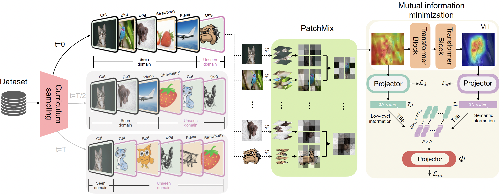

# HiLo: A Learning Framework for Generalized Category Discovery Robust to Domain Shifts (ICLR 2025)


<p align="center">
    <a href="https://arxiv.org/abs/2408.04591"></a>
    <a href="https://visual-ai.github.io/hilo/"></a>
    <a href="#jump"></a>
</p>
<p align="center">
	HiLo: A Learning Framework for Generalized Category Discovery Robust to Domain Shifts <br>
  By
  <a href="https://whj363636.github.io/">Hongjun Wang</a>, 
  <a href="https://sgvaze.github.io/">Sagar Vaze</a>, and 
  <a href="https://www.kaihan.org/">Kai Han</a>.
</p>




## Prerequisite 🛠️

First, you need to clone the SPTNet repository from GitHub. Open your terminal and run the following command:

```
git clone https://github.com/Visual-AI/HiLo.git
cd HiLo
```

We recommend setting up a conda environment for the project:

```bash
conda create --name=hilo python=3.9
conda activate hilo
pip install -r requirements.txt
```

## Running 🏃
### Config

Set paths to datasets and desired log directories in ```config.py```


### Datasets

We use DomainNet and our created Semantic Shift Benchmark Corruption (SSB-C) datasets:

* [DomainNet](https://ai.bu.edu/M3SDA/)
* [SSB-C]() (Look for a place to upload ~20GB of storage. Stay tuned!)

### Checkpoints
Download the checkpints of **HiLo** for different datasets / combination (**only used during evaluation**).
* [Google Drive](https://drive.google.com/drive/folders/1_6CRDBDw_EIdcISIWGGxxV-SIephfPpr?usp=sharing)

### Scripts

**Eval the model**
```
python evaluate.py \
    --dataset_name domainnet \
    --src_env 'real' \
    --aux_env 'painting' \
    --checkpoint_path /path/to/checkpoint.pt \
    --task_type 'A_L+A_U+B->A_U+B+C'
```
To reproduce all main results in the paper, just change the name (``dataset_name``), (``aux_env``) and its corresponding path (``checkpoint_path``) to the pretrained model you downloaded from the above link.

**Train the model**:

```
bash scripts/mi_pmtrans/domainnet.sh
bash scripts/mi_pmtrans/ssbc.sh
```
Just be aware to make necessary changes (e.g., ``PYTHON``, ``SAVE_DIR``, ``WEIGHTS_PATH``, etc).


## Results
### DomainNet results:
#### CUB-C
| Methods | Original (All) | Original (Old) | Original (New) | Corrupted (All) | Corrupted (Old) | Corrupted (New) |
|---------|---------------|----------------|----------------|-----------------|-----------------|-----------------|
| RankStats+ | 19.3 | 22.0 | 15.4 | 13.6 | 23.9 | 4.5 |
| UNO+ | 25.9 | 40.1 | 21.3 | 21.5 | 33.4 | 8.6 |
| ORCA | 18.2 | 22.8 | 14.5 | 21.5 | 23.1 | 18.9 |
| GCD | 26.6 | 27.5 | 25.7 | 25.1 | 28.7 | 22.0 |
| SimGCD | 31.9 | 33.9 | 29.0 | 28.8 | 31.6 | 25.0 |
| UniOT | 27.5 | 29.3 | 26.8 | 27.3 | 33.2 | 22.5 |
| HiLo (Ours) | 56.8 | 54.0 | 60.3 | 52.0 | 53.6 | 50.5 |

#### Scars-C
| Methods | Original (All) | Original (Old) | Original (New) | Corrupted (All) | Corrupted (Old) | Corrupted (New) |
|---------|---------------|----------------|----------------|-----------------|-----------------|-----------------|
| RankStats+ | 14.8 | 20.8 | 7.8 | 11.5 | 22.6 | 1.0 |
| UNO+ | 22.0 | 41.8 | 7.0 | 16.9 | 29.8 | 4.5 |
| ORCA | 19.1 | 28.7 | 11.2 | 15.0 | 22.4 | 8.3 |
| GCD | 22.1 | 35.2 | 20.5 | 21.6 | 29.2 | 10.5 |
| SimGCD | 26.7 | 39.6 | 25.6 | 22.1 | 30.5 | 14.1 |
| UniOT | 24.3 | 37.5 | 22.3 | 22.9 | 31.4 | 13.7 |
| HiLo (Ours) | 39.5 | 44.8 | 37.0 | 35.6 | 42.9 | 28.4 |

#### FGVC-C
| Methods | Original (All) | Original (Old) | Original (New) | Corrupted (All) | Corrupted (Old) | Corrupted (New) |
|---------|---------------|----------------|----------------|-----------------|-----------------|-----------------|
| RankStats+ | 14.4 | 16.4 | 14.5 | 8.3 | 15.6 | 5.0 |
| UNO+ | 22.0 | 33.4 | 15.8 | 16.5 | 25.2 | 8.8 |
| ORCA | 17.6 | 19.3 | 16.1 | 13.9 | 17.3 | 10.1 |
| GCD | 25.2 | 28.7 | 23.0 | 21.0 | 23.1 | 17.3 |
| SimGCD | 26.1 | 28.9 | 25.1 | 22.3 | 23.2 | 21.4 |
| UniOT | 27.3 | 29.8 | 22.5 | 21.6 | 23.5 | 19.6 |
| HiLo (Ours) | 44.2 | 50.6 | 47.4 | 31.2 | 29.0 | 33.4 |


### SSB-C results:

#### Real+Painting
| Methods | Real (All) | Real (Old) | Real (New) | Painting (All) | Painting (Old) | Painting (New) |
|---------|------------|------------|------------|----------------|----------------|----------------|
| RankStats+ | 34.1 | 62.0 | 19.7 | 29.7 | 49.7 | 9.6 |
| UNO+ | 44.2 | 72.2 | 29.7 | 30.1 | 45.1 | 17.2 |
| ORCA | 31.9 | 49.8 | 23.5 | 28.7 | 38.5 | 7.1 |
| GCD | 47.3 | 53.6 | 44.1 | 32.9 | 41.8 | 23.0 |
| SimGCD | 61.3 | 77.8 | 52.9 | 34.5 | 35.6 | 33.5 |
| HiLo (Ours) | 64.4 | 77.6 | 57.5 | 42.1 | 42.9 | 41.3 |

#### Real+Sketch
| Methods | Real (All) | Real (Old) | Real (New) | Sketch (All) | Sketch (Old) | Sketch (New) |
|---------|------------|------------|------------|---------------|---------------|---------------|
| RankStats+ | 34.2 | 62.0 | 19.8 | 17.1 | 31.1 | 6.8 |
| UNO+ | 43.7 | 72.5 | 28.9 | 12.5 | 17.0 | 9.2 |
| ORCA | 32.5 | 50.0 | 23.9 | 11.4 | 14.5 | 7.2 |
| GCD | 48.0 | 53.8 | 45.3 | 16.6 | 22.4 | 11.1 |
| SimGCD | 62.4 | 77.6 | 54.6 | 16.4 | 20.2 | 13.6 |
| HiLo (Ours) | 63.3 | 77.9 | 55.9 | 19.4 | 22.4 | 17.1 |

#### Real+Quickdraw
| Methods | Real (All) | Real (Old) | Real (New) | Quickdraw (All) | Quickdraw (Old) | Quickdraw (New) |
|---------|------------|------------|------------|------------------|------------------|------------------|
| RankStats+ | 34.1 | 62.5 | 19.5 | 4.1 | 4.4 | 3.9 |
| UNO+ | 31.1 | 60.0 | 16.1 | 6.3 | 5.8 | 6.8 |
| ORCA | 19.2 | 39.1 | 15.3 | 3.4 | 3.5 | 3.2 |
| GCD | 37.6 | 41.0 | 35.2 | 5.7 | 4.2 | 6.9 |
| SimGCD | 47.4 | 64.5 | 37.4 | 6.6 | 5.8 | 7.5 |
| HiLo (Ours) | 58.6 | 76.4 | 52.5 | 7.4 | 6.9 | 8.0 |

#### Real+Clipart
| Methods | Real (All) | Real (Old) | Real (New) | Clipart (All) | Clipart (Old) | Clipart (New) |
|---------|------------|------------|------------|----------------|----------------|----------------|
| RankStats+ | 34.0 | 62.4 | 19.4 | 24.1 | 45.1 | 6.2 |
| UNO+ | 44.5 | 66.1 | 33.3 | 21.9 | 35.6 | 10.1 |
| ORCA | 32.0 | 49.7 | 23.9 | 19.1 | 31.8 | 4.3 |
| GCD | 47.7 | 53.8 | 44.3 | 22.4 | 34.4 | 16.0 |
| SimGCD | 61.6 | 77.2 | 53.6 | 23.9 | 31.5 | 17.3 |
| HiLo (Ours) | 63.8 | 77.6 | 56.6 | 27.7 | 34.6 | 21.7 |

#### Real+Infograph
| Methods | Real (All) | Real (Old) | Real (New) | Infograph (All) | Infograph (Old) | Infograph (New) |
|---------|------------|------------|------------|------------------|------------------|------------------|
| RankStats+ | 34.2 | 62.4 | 19.6 | 12.5 | 21.9 | 6.3 |
| UNO+ | 42.8 | 69.4 | 29.0 | 10.9 | 15.2 | 8.0 |
| ORCA | 29.1 | 47.7 | 20.1 | 8.6 | 13.7 | 7.1 |
| GCD | 41.9 | 46.1 | 39.0 | 10.9 | 17.1 | 8.8 |
| SimGCD | 52.7 | 67.0 | 44.8 | 11.6 | 15.4 | 9.1 |
| HiLo (Ours) | 64.2 | 78.1 | 57.0 | 13.7 | 16.4 | 11.9 |


## Citing this work
<span id="jump"></span>
If you find this repo useful for your research, please consider citing our paper:

```
@inproceedings{wang2025hilo,
  title={HiLo: A Learning Framework for Generalized Category Discovery Robust to Domain Shifts},
  author={Wang, Hongjun and Vaze, Sagar and Han, Kai},
  booktitle={ICLR},
  year={2025}
}
```
